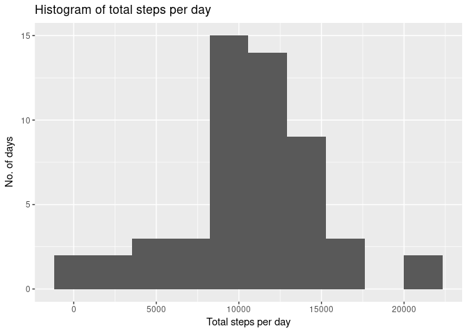
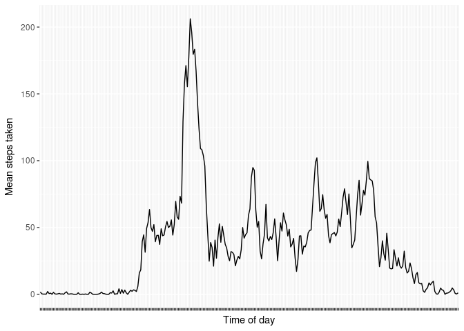
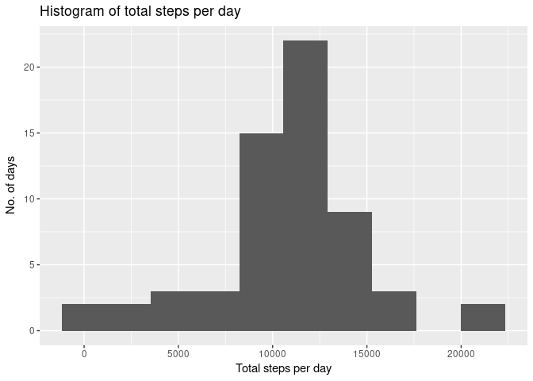
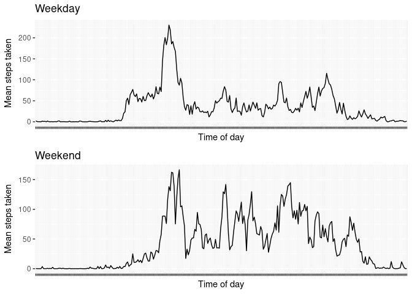

## Loading and preprocessing the data

First load the required packages for use in this analysis:

```r
library(dplyr)
```

```
## 
## Attaching package: 'dplyr'
```

```
## The following objects are masked from 'package:stats':
## 
##     filter, lag
```

```
## The following objects are masked from 'package:base':
## 
##     intersect, setdiff, setequal, union
```

```r
library(lubridate)
```

```
## 
## Attaching package: 'lubridate'
```

```
## The following object is masked from 'package:base':
## 
##     date
```

```r
library(ggplot2)
library(gridExtra)
```

```
## 
## Attaching package: 'gridExtra'
```

```
## The following object is masked from 'package:dplyr':
## 
##     combine
```

Now we extract and load the zipped data in one step, converting to a Dplyr
tibble as well:

```r
steps <- as_tibble(read.csv(unz("activity.zip", "activity.csv")))
steps <- steps %>% 
            mutate(date = ymd(date)) %>%
            mutate(times = substr(as.POSIXct(sprintf("%04.0f", interval), 
                                             format='%H%M'), 12, 16))
```

The second call to `mutate` will convert the integer `interval` column to a time
period in the format of `HH:MM` - this makes the graphs neater as the values
don't jump from e.g. 2255 -> 2300 at the end of each hour.

## What is mean total number of steps taken per day?

First group by the date and create a new tibble with this data:

```r
per_day <- steps %>% group_by(date) %>% summarize(total = sum(steps))
```

Now plot a histogram of the totals:

```r
qplot(per_day$total, bins = 10,
         xlab = 'Total steps per day',
         ylab = 'No. of days',
         main = 'Histogram of total steps per day')
```

```
## Warning: Removed 8 rows containing non-finite values (stat_bin).
```

<!-- -->

For the mean & median, we drop the NA values:

```r
mean(per_day$total, na.rm = TRUE)
```

```
## [1] 10766.19
```

```r
median(per_day$total, na.rm = TRUE)
```

```
## [1] 10765
```

## What is the average daily activity pattern?

First create a tibble of time series data for each 5-minute interval:

```r
intervals <- steps %>%
                group_by(times) %>%
                summarise(totals = mean(steps, na.rm = TRUE))
```

Now plot the data as a line graph

```r
ggplot(data = intervals, aes(x=times, y=totals, group=1)) + geom_line() +
    theme(axis.text.x=element_blank()) +
    xlab('Time of day') + ylab('Mean steps taken')
```

<!-- -->

To get the interval with the maximum number of steps, we can use the `top_n()`
function in Dplyr:

```r
intervals %>% top_n(1,totals)
```

```
## # A tibble: 1 x 2
##   times totals
##   <chr>  <dbl>
## 1 08:35    206
```

## Imputing missing values

Number of rows with missing data:

```r
sum(is.na(steps$steps))
```

```
## [1] 2304
```

The strategy for imputing missing data will be to use the average(mean) for each
interval. We cannot use the mean/median for each day, as some days are entirely
NA-valued.


```r
new_steps <- steps %>%
    group_by(times) %>%
    mutate(steps = replace(steps, is.na(steps), mean(steps, na.rm = TRUE)))
```

Repeating the histogram and summary from part 1:

```r
per_day <- group_by(new_steps,date) %>% summarize(total = sum(steps))

qplot(per_day$total, bins = 10,
         xlab = 'Total steps per day',
         ylab = 'No. of days',
         main = 'Histogram of total steps per day')
```

<!-- -->

```r
mean(per_day$total, na.rm = TRUE)
```

```
## [1] 10766.19
```

```r
median(per_day$total, na.rm = TRUE)
```

```
## [1] 10766.19
```

So we see there is no significant difference from the un-imputed data analsis.

## Are there differences in activity patterns between weekdays and weekends?

First add the `weekend` factor column:

```r
new_steps <- new_steps %>%
    mutate(weekend = as.factor(weekdays(date) %in% c('Saturday','Sunday')))
```

Now create two sets of time-series data for weekdays and weekends:

```r
intervals_wdays <- new_steps %>%
                    filter(weekend == FALSE) %>%
                    group_by(times) %>%
                    summarise(totals = mean(steps))
intervals_wkend <- new_steps %>%
                    filter(weekend == TRUE) %>%
                    group_by(times) %>%
                    summarise(totals = mean(steps))
```

Now plot the time series and arrange using `gridExtra`:

```r
plot1 <- ggplot(data = intervals_wdays, aes(x=times, y=totals, group=1)) + geom_line() +
            theme(axis.text.x=element_blank()) +
            xlab('Time of day') + ylab('Mean steps taken') + ggtitle('Weekday')
plot2 <- ggplot(data = intervals_wkend, aes(x=times, y=totals, group=1)) + geom_line() +
            theme(axis.text.x=element_blank()) +
            xlab('Time of day') + ylab('Mean steps taken') + ggtitle('Weekend') 
grid.arrange(plot1, plot2, nrow=2)
```

<!-- -->
